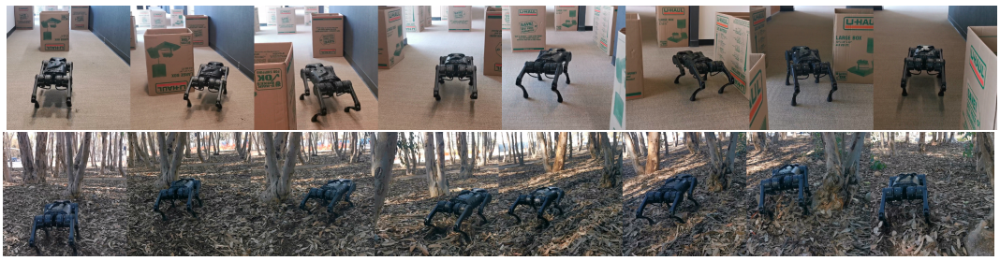
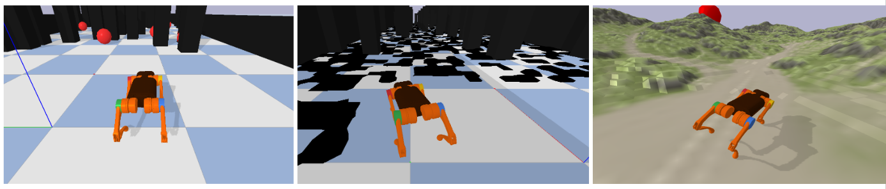
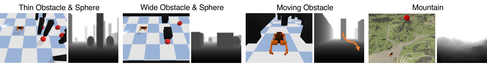
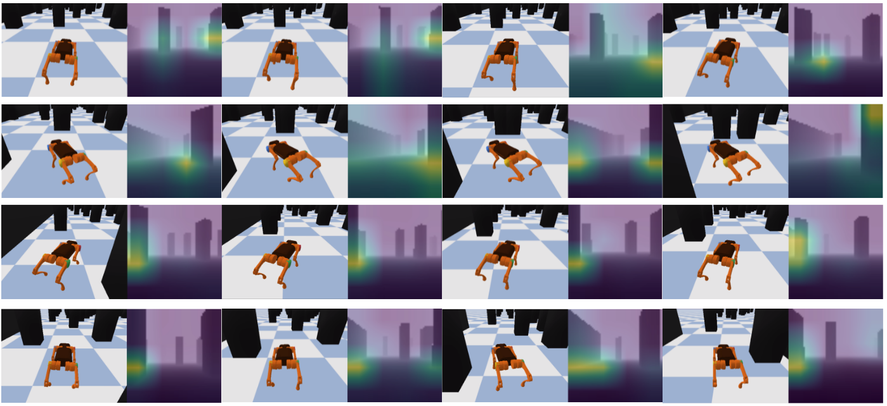
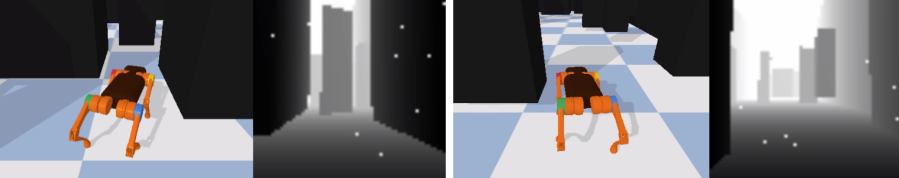
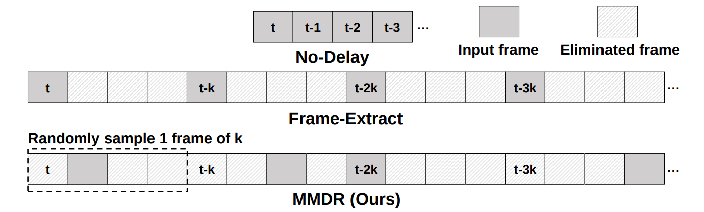

# Toolkit for Vision-Guided Quadrupedal Locomotion Research (Pybullet)


Official implementations of

**Learning Vision-Guided Quadrupedal Locomotion End-to-End with Cross-Modal Transformers** (LocoTransformer)<br/>
[Ruihan Yang*](https://rchalyang.github.io/), [Minghao Zhang*](https://www.minghaozhang.com), [Nicklas Hansen](https://nicklashansen.github.io/), [Huazhe Xu](http://hxu.rocks/), [Xiaolong Wang](https://xiaolonw.github.io)

[[Arxiv]](https://arxiv.org/abs/2107.03996) [[Webpage]](https://rchalyang.github.io/LocoTransformer/) [[ICLR Paper]](https://openreview.net/forum?id=nhnJ3oo6AB)

and

**Vision-Guided Quadrupedal Locomotion in the Wild with Multi-Modal Delay Randomization** (MMDR)<br/>
[Chieko Sarah Imai*](https://www.linkedin.com/in/csimai/), [Minghao Zhang*](https://www.minghaozhang.com), [Yuchen Zhang*](https://github.com/infinity1096), [Marcin Kierebiński](https://mrkiereb.com/), [Ruihan Yang](https://rchalyang.github.io/), [Yuzhe Qin](https://yzqin.github.io/), [Xiaolong Wang](https://xiaolonw.github.io)

[[Arxiv]](https://arxiv.org/abs/2109.14549) [[Webpage]](https://mehooz.github.io/mmdr-wild/)


<!--  -->

Our repository contains the necessary functions to train the policy in simulation and deploy the learned policy on the real robot in the real world. Directly testes in the real robot, we can see the A1 robot traverses in versatile real-world scenarios:


## Simulation Environments

<!-- Our repository contains the following environments in simulation:



including uneven terrains, random-shaped obstacles, and various other environments. -->

With the depth maps as policy input, RL agents can learn to navigate through our simulated environments. We mainly use the following scenarios (tasks in LocoTransformer):



The following visualization results show the attention mechanism of the LocoTransformer at the different regions of the image:



In MMDR, we also simulate multiple sim-to-real gap. For example, we simulate the "blinding spot" in the RealSense when sampling depth images:




We also provide the functions to simulate the multi-modal latencies. 




Please refer to our [paper](https://arxiv.org/abs/2109.14549) for more details.


## Setup

We assume that you have access to a GPU with CUDA >=9.2 support. All dependencies can then be installed with the following commands:

```
pip install -e .
```

## Configuration for enviornments

#### RL training
We use config files in folder `config` to configure the parameters of training and enviornment.
In `config/rl/`, there are three types of config files:
- `static`: Train in basic plane ground or uneven terrain with static obstacles.
- `moving`: Train in basic plane ground or uneven terrain with moving obstacles.
- `challenge`: Some challenging scenarios like mountain, hill, and so on.

In each folder, we have subfolders for different algorithms:
- `naive_baseline`: Train a naive baseline policy. No frame-extraction, no delay randomization.
- `frame_extract4`: Train a policy with frame-extraction (k=4 in the MMDR paper). No delay randomization.
- `frame_extract4_fixed_delay`: Train a policy with frame-extraction (k=4 in the MMDR paper) and fixed delay in all episodes.
- `frame_extract4_random_delay`: Train a policy with frame-extraction (k=4 in the MMDR paper) and random delay in each episodes.
- `locotransformer`: Train a LocoTransformer policy.
- `locotransformer_random_delay`: Train a LocoTransformer policy with random delay in each episodes.

In challeging scenarios, we only put the `baseline` and `locotransformer` folder as config files, since we didn't conduct MMDR experiements on these scenarios.

#### Visual-MPC Training
While RL can navigate from proprioception and vision by outputing the joint angles directly, we also provide a visual-MPC training to output the control command (linear and angular velocity). See the comparison in Locotransformer paper.

To reproduce, we use the following config folders:
- `mpc`: Train a visual-MPC policy with both proprioception and vision as input.
- `mpc_vision_only`: Train a visual-MPC policy with only vision as input.

Besides, You can also configurate the network architecture in `config/`. We only use PPO for all the experiments, so we didn't put the configuration of other algorithms. But users can still use them in `torchrl` library.

## Training & Evaluation

The `starter` directory contains training and evaluation scripts for all the included algorithms. The `config` directory contains training configuration files for all the experiments. You can use the python scripts, e.g. for training call

```
python starter/ppo_locotransformer.py \
  --config config/rl/static/locotransformer/thin-goal.json \
  --seed 0 \
  --log_dir {YOUR_LOG_DIR} \
  --id {YOUR_ID}
```

to run PPO+LocoTransformer on the environment, `thin-goal`. And you can use

```
python starter/locotransformer_viewer.py \
  --seed 0 \
  --log_dir {YOUR_LOG_DIR} \
  --id {YOUR_ID} \
  --env_name A1MoveGround
```
to test the trained model on the same environment.

## Real Robot Deployment

### Set up robot interface

Since our robot interface based on  [Motion Imitation](https://github.com/erwincoumans/motion_imitation). We provide the simplified interface setup instruction here. For detailed version please check [Motion Imitation](https://github.com/erwincoumans/motion_imitation)

build the python interface by running the following:
```bash
cd third_party/unitree_legged_sdk
mkdir build
cd build
cmake ..
make
```
Then copy the built `robot_interface.XXX.so` file to the main directory (where you can see this README.md file).

To deploy visual-policy, we should also set up Intel RealSense interface. Please check detailed instruction on [Librealsense](https://github.com/IntelRealSense/librealsense)

### (Optional) Convert pytorch policy to tensorrt policy
```
# Current 
bash a1_hardware/convert_tensor_rt/convert_trt.sh $EXP_ID $SEED $LOG_ROOT_PATH
```


### Run trained policy on the robot.
```
# For Tensor RT Version
python a1_hardware/execute_locotransformer_trt.py

# For Pytorch Version
python a1_hardware/execute_locotransformer.py
```
**We use joint control for A1, the default action and action scale are predefined. Normalization information for depth input is also predefined.**

**Some system path and configuration may varies, please modify accordingly.**

## Results

See [LocoTransformer](https://arxiv.org/abs/2107.03996) and [MMDR](https://arxiv.org/abs/2109.14549) for results.


## Citation
<a name="citation"></a>
If you find our code useful in your research, please consider citing our work as follows:

for LocoTransformer:
```
@inproceedings{
    yang2022learning,
    title={Learning Vision-Guided Quadrupedal Locomotion End-to-End with Cross-Modal Transformers},
    author={Ruihan Yang and Minghao Zhang and Nicklas Hansen and Huazhe Xu and Xiaolong Wang},
    booktitle={International Conference on Learning Representations},
    year={2022},
    url={https://openreview.net/forum?id=nhnJ3oo6AB}
}
```

for MMDR:
```

@inproceedings{Imai2021VisionGuidedQL,
    title={Vision-Guided Quadrupedal Locomotion in the Wild with Multi-Modal Delay Randomization},
    author={Chieko Imai and Minghao Zhang and Yuchen Zhang and Marcin Kierebinski and Ruihan Yang and Yuzhe Qin and Xiaolong Wang},
    eprint={2109.14549},
    year={2021},
    archivePrefix={arXiv},
    primaryClass={cs.RO},
    booktitle={arXiv preprint},
    volume={2109.14549},
}
```

## Acknowledgements

This repository is a product of our work on [LocoTransformer](https://rchalyang.github.io/LocoTransformer/) and [MMDR](https://mehooz.github.io/mmdr-wild/). Our RL implementation is based on [TorchRL](https://github.com/RchalYang/torchrl), and the environment implementation is based on [google motion-imitation](https://github.com/google-research/motion_imitation). The python interface for real robot is also based on [google motion-imitation](https://github.com/google-research/motion_imitation). 
